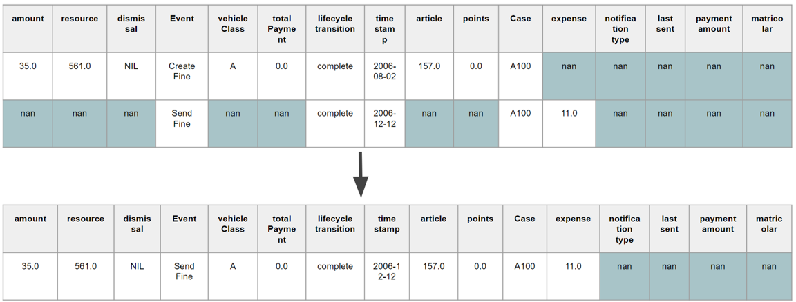
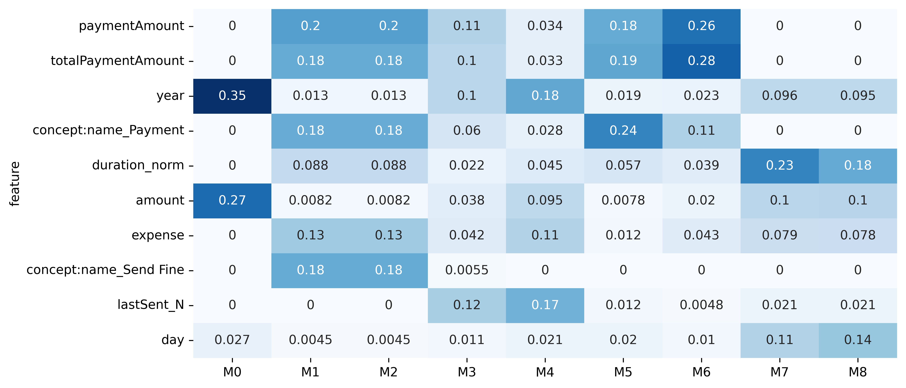
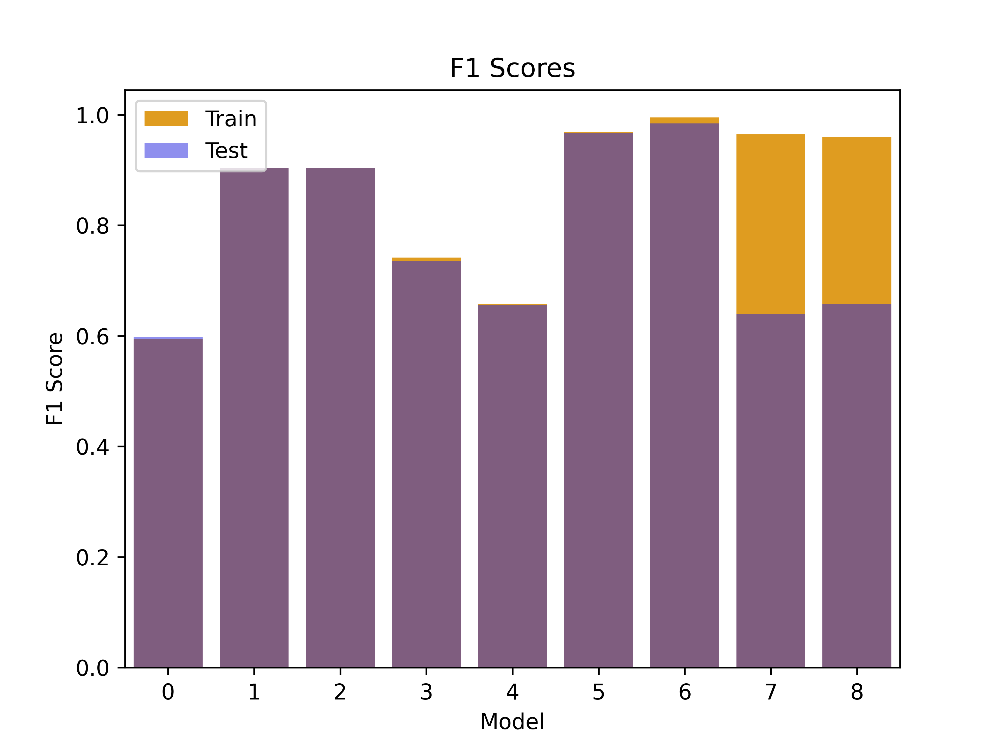

# Project Title: Predictive Process Mining on Road Traffic Fine Management XES Event Log
## Introduction
The goal of this project is to use predictive process mining techniques to analyze the Road Traffic Fine Management event log (XES) and make predictions on whether fines were paid or not.

## Prerequisites
Python 3
Required libraries: pandas, sklearn, matplotlib, seaborn, pm4py

## Data Exploration and Cleaning
The first step is to explore the data and clean it as necessary. This includes handling unusual cases and converting data into a format that can be used for modeling.

## Dataset Creation
The second step is to create datasets for each step in the traces. This includes creating a dataset for all first steps in traces, a dataset for all first and second steps, and so on. A total of 9 datasets were created for this project. You can see the Creation Process in the Picture below.




## Modeling
The third step is to build a Random Forest model (with n_estimators set to 1000 and max depth set to 10) for all the datasets to predict whether fines were paid or not. A test set was created by randomly selecting 20% of the traces. The test set is for every model the same.

### Features
 The following features were used for modeling:
```python	
    numeric_features = ["amount", "points", "duration_norm", "totalPaymentAmount", "expense", "paymentAmount"]
    categorical_features = ["vehicleClass", "article", "dismissal", "concept:name","notificationType", "lastSent", "matricola"]
    timestamp_features = ["year", "month", "day", "hour", "weekday"]
```
Categorical features were encoded using one-hot encoding.

### Target 
Saldo: The target variable is the saldo column (Fine amount - total payment amount with a threshold of 2€).

## Evaluation and Visualization
The fourth step is to evaluate the models and predict probabilities on the test set. Additionally, feature importance will be calculated to understand which features are most important in making predictions. The final step is to visualize the results using Tableau.
See the Visualization in the Picture below.

Feature Importance:



F1 Scores over each model in training and test set:



Some other visualizations were made in Tableau:


